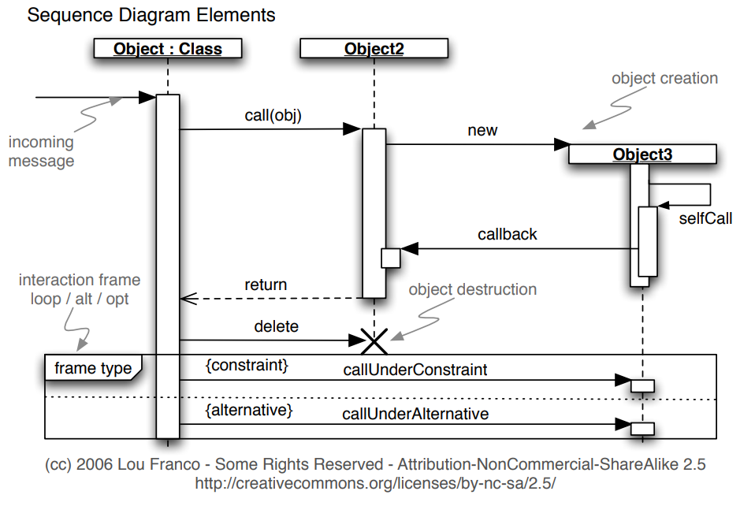
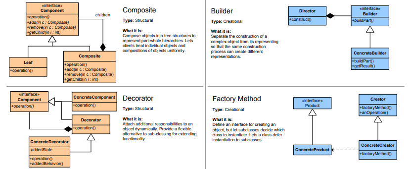

# 📘 Révision : Conception Logicielle

## 📝 Sommaire
- [📘 Révision : Conception Logicielle](#-révision--conception-logicielle)
  - [📝 Sommaire](#-sommaire)
  - [📊 UML](#-uml)
    - [🖼️ Diagrammes UML](#️-diagrammes-uml)
      - [📌 Les 4 rôles principaux dans le projet :](#-les-4-rôles-principaux-dans-le-projet-)
    - [🏗️ Cas d'utilisation](#️-cas-dutilisation)
      - [🔄 Notions de `include` et `extend`](#-notions-de-include-et-extend)
      - [✅ À faire / ❌ À éviter dans les diagrammes de cas d'utilisation](#-à-faire---à-éviter-dans-les-diagrammes-de-cas-dutilisation)
    - [📏 Diagrammes de classes](#-diagrammes-de-classes)
      - [✅ À faire / ❌ À éviter dans les diagrammes de classes](#-à-faire---à-éviter-dans-les-diagrammes-de-classes)
    - [🔄 Diagramme de séquence](#-diagramme-de-séquence)
      - [✅ À faire / ❌ À éviter dans les diagrammes de séquence](#-à-faire---à-éviter-dans-les-diagrammes-de-séquence)
  - [🔧 Design Patterns](#-design-patterns)
  - [](#)
  - [🥒 Cucumber](#-cucumber)
    - [📝 Gherkin et Scénarios](#-gherkin-et-scénarios)
      - [Exemple :](#exemple-)
    - [🔗 Intégration dans les tests](#-intégration-dans-les-tests)

---

## 📊 UML

### 🖼️ Diagrammes UML
Les diagrammes UML permettent de représenter différents aspects d'un système logiciel

#### 📌 Les 4 rôles principaux dans le projet :
- **QA (Quality Assurance)** : Responsable de garantir la qualité des livrables logiciels, notamment en définissant les critères d'acceptation.
- **OPS (Operations)** : Se concentre sur le déploiement, la maintenance et le bon fonctionnement du système en production.
- **PO (Product Owner)** : Responsable de prioriser les besoins métier et de s'assurer que les fonctionnalités sont conformes aux exigences des utilisateurs.
- **SA (Solution Architect)** : Conçoit l'architecture technique du système et veille à sa cohérence et robustesse.


### 🏗️ Cas d'utilisation
Le diagramme de cas d'utilisation illustre les interactions entre les **acteurs** (utilisateurs externes) et les **systèmes**. Il permet de modéliser les fonctionnalités attendues.

#### 🔄 Notions de `include` et `extend`
- **Include** : le cas d'utilisation cible **doit** inclure un autre cas d'utilisation (partage de comportement obligatoire). Cela est utilisé pour **factoriser** des fonctionnalités communes entre plusieurs cas d'utilisation.
  
  > **Exemple** : Dans un système de réservation de vol, **Réserver un vol** inclut systématiquement le cas d'utilisation **Saisir informations de paiement**.

- **Extend** : un cas d'utilisation **peut** être étendu par un autre (optionnel). C'est utilisé pour ajouter un comportement supplémentaire dans des conditions spécifiques.
  
  > **Exemple** : **Réserver un vol** pourrait être étendu par **Utiliser des points de fidélité** si l'utilisateur a des points disponibles.


#### ✅ À faire / ❌ À éviter dans les diagrammes de cas d'utilisation
- ❌ Le **système d'information (SI)** ne doit pas être représenté comme un acteur ni un cas d'utilisation. C'est l'ensemble des cas d'utilisation qui le représente.  
- ❌ **La base de données (BD)** n'est pas un acteur. Elle peut être un moyen d'implémentation, mais ne doit pas apparaître en tant qu'acteur.
- ✅ Les **acteurs** doivent être des personnes ou des systèmes informatiques interagissant **directement** avec le système. Par exemple, celui qui tape sur le clavier, pas celui qui regarde.
- ❌ Un cas d'utilisation qui n'implique pas le **système informatique** n'est pas un cas d'utilisation, mais une activité métier.
- ❌ Ne représentez pas de relations d'ordre entre les cas d'utilisation. Utilisez uniquement **inclusion**, **spécialisation**, ou **extension**.
- ✅ Assurez-vous que les cas d'utilisation ne se chevauchent pas. Si un cas est inclus ou spécialise un autre, explicitez-le.


### 📏 Diagrammes de classes
Le diagramme de classes représente les **classes** du système, leurs **attributs**, **méthodes**, et leurs **relations** (association, héritage, etc.).


#### ✅ À faire / ❌ À éviter dans les diagrammes de classes
- ❌ Les **acteurs** ne doivent pas être représentés comme des objets du système. Ils peuvent avoir un proxy ou un compte utilisateur, mais pas de classe directe dans le système.
- ✅ Les attributs des classes doivent être des **types de base** (entier, chaîne, date). Toutes les autres informations doivent être représentées par des **associations** avec d'autres classes.
- ❌ Évitez l'utilisation de **tableaux d'ID**, de **tableaux de tableaux** ou de **maps** dans les classes. Ce sont de mauvaises pratiques dans les diagrammes UML.


### 🔄 Diagramme de séquence
Le diagramme de séquence illustre comment les objets **interagissent entre eux** au cours du temps pour réaliser une opération.


#### ✅ À faire / ❌ À éviter dans les diagrammes de séquence
- ✅ Lorsque le diagramme de séquence met en œuvre des interactions avec un utilisateur, représentez l'**objet informatique** qui supporte ces interactions (par exemple, une interface graphique ou une manette de jeu).
- ❌ N'utilisez pas une ligne de vie générique "System". Utilisez une classe comme une **Facade** qui capture la connexion au backend.
- ✅ Distribuez bien les responsabilités entre les objets, et ne concentrez pas tout dans une seule classe.
- ❌ Un diagramme de séquence doit se concentrer sur **un seul cas d'utilisation**. Assurez-vous qu'il soit cohérent avec les cas d'utilisation modélisés.
- ✅ Assurez-vous que les envois de message dans le diagramme de séquence se fassent uniquement entre des instances de classes **liées entre elles** par des associations, agrégations, ou objets récupérés par des retours de méthode.
- ✅ Les **méthodes utilisées** dans les diagrammes de séquence doivent exister dans le diagramme de classes et être associées aux récepteurs des messages.


---

## 🔧 Design Patterns




---

## 🥒 Cucumber

### 📝 Gherkin et Scénarios
**Cucumber** est un outil de tests basé sur des spécifications en langage naturel. Le langage **Gherkin** est utilisé pour écrire les **scénarios** de test, sous forme de :
- **Given** (état initial)
- **When** (action)
- **Then** (résultat attendu)

#### Exemple : 

```gherkin
  Feature: Réservation d'un vol

  Scenario: Réserver un vol avec succès
    Given un utilisateur est sur la page de recherche de vols
    When il recherche un vol de Paris à New York
    And il sélectionne un vol disponible
    And il entre ses informations de paiement
    Then la réservation est confirmée
    And un email de confirmation est envoyé
```

```java
  public class ReservationSteps {

    @Given("un utilisateur est sur la page de recherche de vols")
    public void utilisateurSurPageRechercheVols() {
        System.out.println("Utilisateur est sur la page de recherche de vols.");
    }

    @When("il recherche un vol de Paris à New York")
    public void rechercheVol() {
        System.out.println("Recherche d'un vol de Paris à New York.");
    }

    @When("il sélectionne un vol disponible")
    public void selectionVol() {
        System.out.println("Sélection d'un vol disponible.");
    }

    @When("il entre ses informations de paiement")
    public void entrerInfosPaiement() {
        System.out.println("Entrée des informations de paiement.");
    }

    @Then("la réservation est confirmée")
    public void confirmationReservation() {
        System.out.println("La réservation est confirmée.");
    }

    @Then("un email de confirmation est envoyé")
    public void emailConfirmation() {
        System.out.println("Un email de confirmation est envoyé.");
    }
}
```

### 🔗 Intégration dans les tests
Cucumber permet l'intégration des tests avec différents langages (Java, Ruby, etc.) et automatise les scénarios pour valider le comportement des applications.
