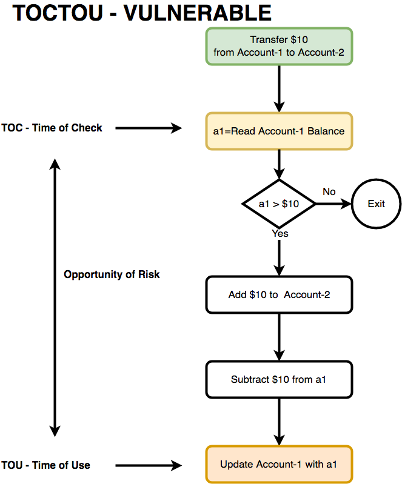

# Révision : Sécurité Logicielle

## Table des Matières

1. [Vulnérabilité de Condition de Course (Race Condition)](#vulnerabilite-de-condition-de-course-race-condition)
2. [Injection SQL (SQLi)](#injection-sql-sqli)
3. [Cross-Site Scripting (XSS)](#cross-site-scripting-xss)
4. [Cross-Site Request Forgery (CSRF)](#cross-site-request-forgery-csrf)

---

## 1. Vulnérabilité de Condition de Course (Race Condition)


### Définition

- **Vulnérabilité** qui se produit lorsque deux ou plusieurs processus ou threads accèdent à une ressource partagée de manière non synchronisée, entraînant un comportement imprévisible ou indésirable. Les vulnérabilités de condition de course sont fréquentes dans les systèmes multithread ou multi-utilisateurs.

### Conditions nécessaires

1. **Concurrence** : Deux flux d'exécution fonctionnent simultanément.
2. **Objet partagé** : Une ressource est utilisée par plusieurs flux.
3. **Changement d'état** : Au moins un flux modifie l'état de la ressource.

### Exemple

- Un fichier temporaire est créé dans `/tmp` :
  ```bash
  ln -s /etc/passwd /tmp/tmpfile
  ```
  Le programme crée un fichier temporaire supposé sûr mais modifie `/etc/passwd`.

- **TOCTOU (Time of Check to Time of Use)** : Une vulnérabilité classique où une condition est vérifiée (par exemple, des permissions) puis utilisée, permettant à un attaquant de modifier la ressource entre la vérification et l'utilisation.
- 

### Prévention

- **Synchronisation** : Verrouiller les ressources partagées avec des outils comme les mutex pour garantir qu'un seul thread accède à une ressource à la fois.
- **Suppression des races** : Utiliser des opérations atomiques ou restreindre les accès concurrents.
- **Utilisation de primitives de synchronisation** : Comme les sémaphores ou les verrous pour éviter les accès non autorisés.
- **Analyse dynamique et statique** : Utiliser des outils comme **Eraser** ou **RacerX** pour détecter les vulnérabilités de condition de course pendant le développement.
- **Protection par liens symboliques** : Désactiver la possibilité de suivre des liens symboliques dans des répertoires accessibles en écriture par le monde (par exemple, avec `fs.protected_symlinks` sur Linux).

### Exemples de questions potentielles

1. **Quelles sont les méthodes permettant d'éviter les conditions de course sur des fichiers temporaires ?**
   - **Réponse attendue** : Utiliser des fichiers temporaires sécurisés avec des noms aléatoires et des permissions appropriées.

2. **Qu'est-ce qu'une vulnérabilité TOCTOU ?**
   - **Réponse attendue** : Une vulnérabilité Time of Check to Time of Use, qui survient quand un changement d'état intervient entre la vérification d'une condition et l'utilisation de cette condition.

---

## 2. Injection SQL (SQLi)


### Définition

- Exploiter des entrées utilisateur non vérifiées pour injecter des commandes SQL malveillantes dans une base de données. Cela permet à un attaquant de manipuler la base de données à son avantage, en contournant les mécanismes de sécurité.

### Types d'injection SQL

1. **In-Band** : Les résultats sont retournés directement dans la réponse.
2. **Blind** : Exploitation basée sur des réponses conditionnelles, où l'attaquant ne voit pas les résultats mais peut inférer des informations en fonction des réponses.
3. **Out-of-Band** : Utilisation de canaux alternatifs pour extraire des données (e.g., e-mails ou DNS).

### Exemple

- Formulaire de connexion vulnérable :
  ```sql
  SELECT * FROM users WHERE username = 'admin' OR '1'='1';
  ```
  Cette requête retourne tous les utilisateurs, permettant une connexion non autorisée.

- **Attaque de suppression de table** :
  ```sql
  '; DROP TABLE users; --
  ```
  Ce type d'injection peut supprimer des tables entières si des contrôles ne sont pas en place.

### Prévention

- **Requêtes préparées** :
  ```java
  PreparedStatement stmt = conn.prepareStatement("SELECT * FROM users WHERE username = ?");
  stmt.setString(1, userInput);
  ```
  L'utilisation de paramètres liés empêche l'injection de code SQL.
- **Validation stricte des entrées** : Autoriser uniquement des caractères spécifiques.
- **Utilisation d'ORM (Object Relational Mapping)** : Les ORM comme Hibernate peuvent aider à éviter les injections SQL en manipulant les données de manière sécurisée.
- **Limiter les privilèges** : Les comptes de base de données utilisés par l'application doivent avoir les privilèges minimums requis.
- **Utilisation d'outils automatisés** : **sqlmap** peut être utilisé pour tester la sécurité d'une application face aux attaques d'injection SQL en automatisant la détection de vulnérabilités.

### Exemples de questions potentielles

1. **Quel est le principal avantage des requêtes préparées contre les injections SQL ?**
   - **Réponse attendue** : Elles empêchent l'injection en séparant les instructions SQL des entrées utilisateur.

2. **Quelles techniques autres que les requêtes préparées peuvent aider à prévenir les injections SQL ?**
   - **Réponse attendue** : Utilisation d'ORM, validation des entrées, et limitation des privilèges de la base de données.

3. **Quel est le rôle de l'outil sqlmap dans la sécurité des applications ?**
   - **Réponse attendue** : **sqlmap** est un outil automatisé utilisé pour détecter et exploiter des vulnérabilités d'injection SQL dans les applications web, afin d'évaluer la sécurité.

---

## 3. Cross-Site Scripting (XSS)


### Définition

- Injection de scripts malveillants dans des pages Web visualisées par d'autres utilisateurs. Ces scripts peuvent être utilisés pour voler des cookies, rediriger des utilisateurs, ou altérer le contenu d'une page.

### Types

1. **Reflected XSS** : Les scripts sont injectés via une requête HTTP et renvoyés immédiatement à l'utilisateur.
2. **Stored XSS** : Les scripts sont stockés dans une base de données ou un autre stockage et exécutés chaque fois que la page est chargée par un utilisateur.
3. **DOM-Based XSS** : Les scripts sont exécutés uniquement via le DOM du client, souvent sans interaction serveur.

### Exemple

- Recherche vulnérable :
  ```html
  <div>Résultat pour : <?= $_GET['term'] ?></div>
  ```
  L'utilisateur fournit `</div><script>alert(1)</script>`, ce qui exécute du code JavaScript non désiré.

### Prévention

- **Échappement des sorties** :
  ```php
  htmlspecialchars($input, ENT_QUOTES, 'UTF-8');
  ```
  Empêche l'injection de caractères spéciaux interprétés comme du code.
- **CSP (Content Security Policy)** : Bloquer l'exécution des scripts non autorisés en définissant des politiques de contenu strictes.
- **Valider les entrées** : Éviter d'accepter du code dans les champs utilisateur et vérifier les types de données.
- **Protéger les cookies** : Utiliser l'attribut `HttpOnly` pour empêcher l'accès aux cookies via JavaScript.
- **Protection côté serveur et client** : Une application Web peut être protégée côté serveur en empêchant l'injection de scripts, et côté client en filtrant les entrées.
- **Désactiver JavaScript** : La désactivation de JavaScript dans le navigateur peut supprimer tout risque d'attaque XSS, mais cela rend la navigation quasi impossible avec les sites modernes.

### Exemples de questions potentielles

1. **Quel est le principal risque lié à une attaque XSS de type Stored ?**
   - **Réponse attendue** : Le code malveillant est stocké sur le serveur et est exécuté à chaque fois qu'un utilisateur visite la page affectée.

2. **Quelle est la différence entre Reflected XSS et DOM-based XSS ?**
   - **Réponse attendue** : Reflected XSS implique que le script est renvoyé par le serveur, tandis que DOM-based XSS est exécuté directement par le client via la manipulation du DOM.

3. **Quelles méthodes peuvent être utilisées pour protéger une application contre les attaques XSS ?**
   - **Réponse attendue** : Protection côté serveur, côté client, désactivation de JavaScript, échappement des sorties, et utilisation de CSP.

---

## 4. Cross-Site Request Forgery (CSRF)


### Définition

- Exploitation de la session authentifiée d'un utilisateur pour exécuter des actions non souhaitées sur une application Web à l'insu de l'utilisateur.

### Fonctionnement

1. L'utilisateur visite un site malveillant tout en étant connecté à une autre application.
2. Une requête est envoyée avec les cookies de session de l'utilisateur, qui sont automatiquement inclus par le navigateur.

### Exemple

- Requête GET malveillante intégrée dans une image :
  ```html
  
  ```
  En visitant la page contenant cette image, l'utilisateur envoie une requête de transfert à son insu.

### Prévention

- **Jetons anti-CSRF** : Inclure un token unique dans chaque formulaire.
  ```html
  <input type="hidden" name="csrf_token" value="123456789">
  ```
  Le token doit être vérifié côté serveur pour valider la requête.
- **Entête `SameSite` pour les cookies** :
  ```http
  Set-Cookie: session_id=abc123; SameSite=Strict
  ```
  Empêche les navigateurs d'envoyer des cookies lors de requêtes intersites.
- **Vérification des référents** : S'assurer que les requêtes proviennent du domaine attendu en utilisant l'entête `Referer` ou `Origin`.
- **Double soumission de token** : Envoyer un token à la fois dans les cookies et les paramètres de requête, et vérifier qu'ils correspondent.

### Exemples de questions potentielles

1. **Pourquoi l'en-tête `SameSite` pour les cookies est-il efficace contre les attaques CSRF ?**
   - **Réponse attendue** : Il empêche les navigateurs d'inclure les cookies lors des requêtes provenant de domaines différents.

2. **En plus des jetons anti-CSRF, quelles autres mesures peuvent être prises pour se protéger des attaques CSRF ?**
   - **Réponse attendue** : Vérifier l'origine des requêtes à l'aide des en-têtes `Referer` ou `Origin` et limiter la durée de validité des sessions.

3. **Quels sont les risques de ne pas utiliser des tokens anti-CSRF dans les formulaires sensibles ?**
   - **Réponse attendue** : Risque d'exécution d'actions non autorisées, comme des transactions ou des modifications de paramètres, à l'insu de l'utilisateur.

## Ancien QCM


