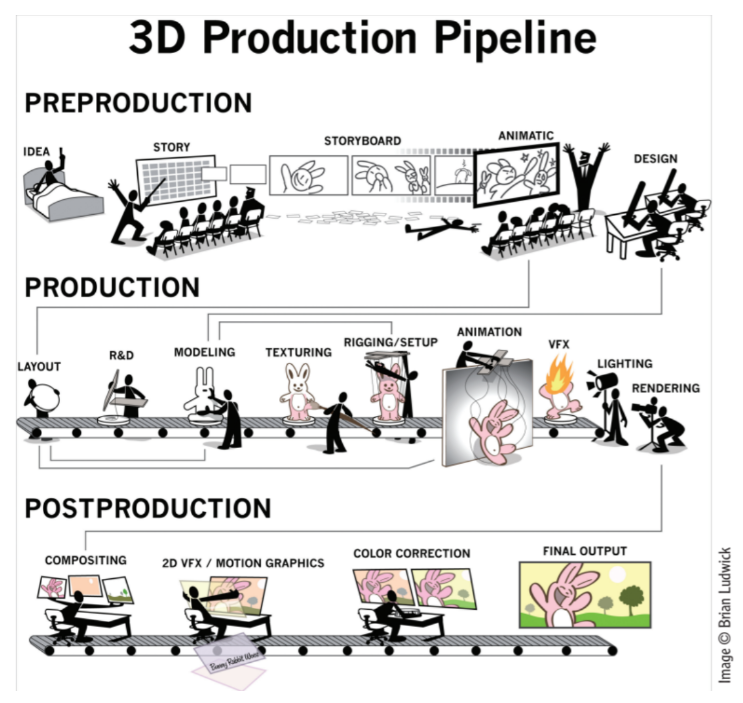
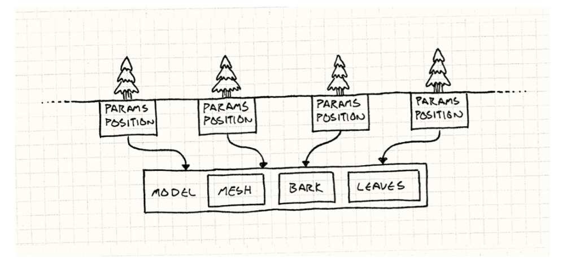
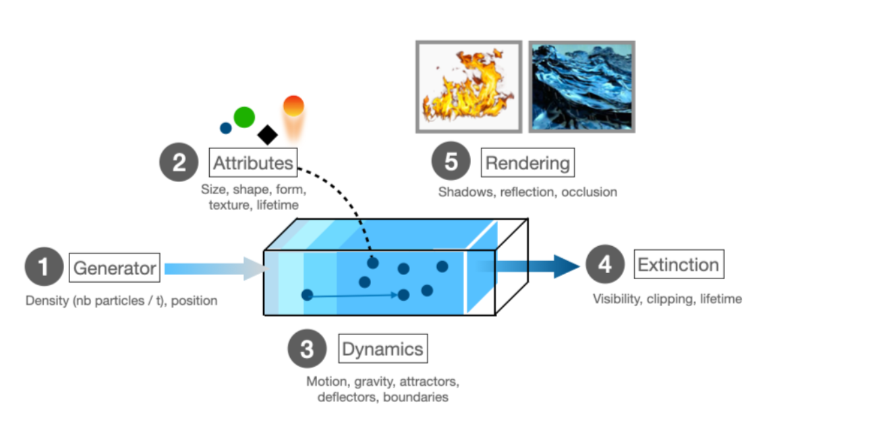
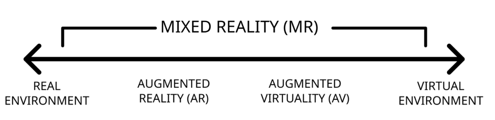
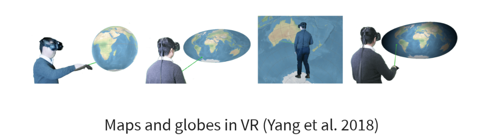
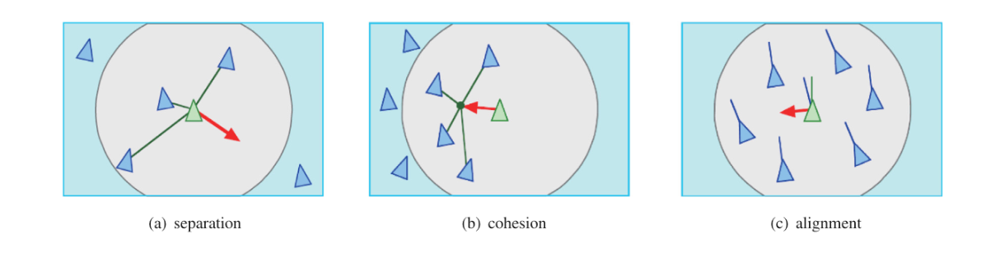
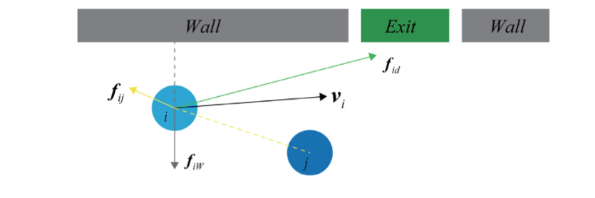
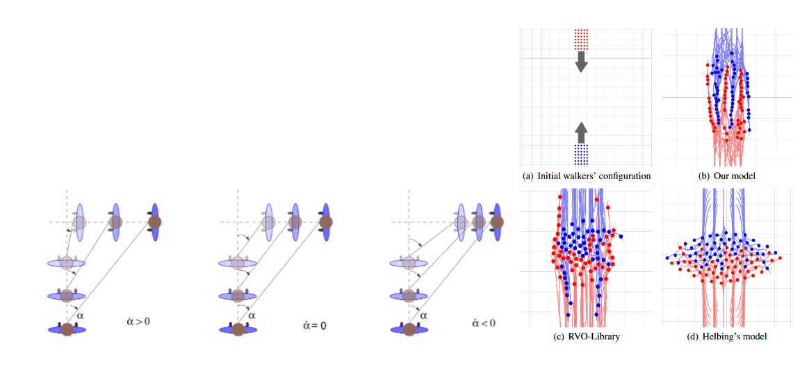
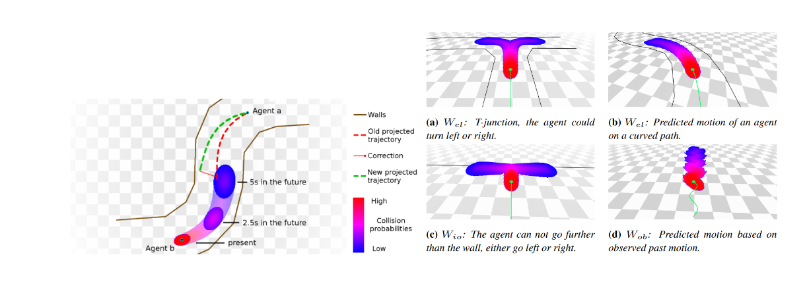
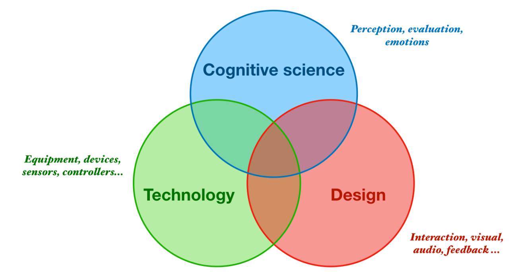

# 1. **Transformation** 🔄

Application de **transformations géométriques** (translation, rotation, mise à l'échelle) pour positionner les objets dans la scène.

- Passage de l'**espace objet** à l'**espace monde** (world space), puis à l'**espace caméra** (view space).

---

# 2. **Projection** 🎥

Conversion des coordonnées **3D** en coordonnées **2D** sur l'écran.

- Utilisation de **projections orthogonales** (sans perspective) ou **projections en perspective** (avec effet de profondeur).

**Résultat :** les objets sont prêts pour la **rasterisation** et l'affichage.

---

# 3. **Clipping** ✂️ (Recadrage)

Le clipping consiste à supprimer les parties d’un objet qui se trouvent en dehors du champ de vision de la caméra.

- Cela s’applique aux objets qui sont partiellement ou totalement en dehors du **frustum** de la caméra (la pyramide de vision dans le cas d’une projection en perspective).
- Il empêche les calculs inutiles sur des parties invisibles de la scène.
- Il peut être réalisé au niveau des **sommets** (vertex clipping) ou des **fragments/pixels** (fragment clipping).

> La **rasterization** est l’étape où les primitives (triangles, lignes, points) définies en 3D sont converties en pixels sur un écran 2D. Voici comment ça fonctionne en détail :
> - Utilise le **Z-Buffer** pour déterminer l'occlusion.

---

# **Le pipeline d'animation 3D** 

### **Pré-production de l'animation**
- **Idéation** : brainstorming à l'échelle du projet pour un projet d'animation.
- **Storyboard** : séquence shot-à-shot montrant le mouvement.
- **Animatique** : une première version de l'animation.

### **Production**
- **Layout (Final)** : Utilisation de géométrie simple (boîtes, sphères par exemple) pour pré-visualiser l'animation.
- **Modélisation & Texturisation** : Création de la maillage 3D et ajout de matériaux et textures (TD1 + TD2).
- **Rigging** : Ajout de la structure osseuse pour préparer l'animation (TD2).
- **Animation** : Création des mouvements par **keyframing** pour générer du mouvement (TD2).
- **VFX, Éclairage, Rendu** : Dernières étapes utilisant le logiciel d'animation 3D.

### **Post-production**
- **Compositing** : Couches qui ajustent la scène rendue.
- **Autres traitements** : VFX 2D, correction des couleurs, montage.

---

# **Animation : Squash and Stretch**

Quels éléments sont impliqués dans une animation de squash et stretch ?

- **Volume** : Le volume global des objets/personnages doit être préservé pour assurer le réalisme.
- **Gravité** : Influence sur la trajectoire balistique de l'objet.
- **Restitution** : Perte d'énergie lors de la collision.
- **Étirement maximum / Squash minimum** : Jusqu'où l'objet peut-il être étiré ou écrasé ?
- **Taux de Stretch/Squash** : Vitesse à laquelle l'objet s'étire ou se compresse avant et après la collision.

---

# **Méthodes d'animation**
- **Keyframing** : Utilisation des courbes et de l'interpolation pour générer un mouvement fluide.
- **Animation procédurale** : Décrire algorithmiquement le mouvement.
- **Animation basée sur la physique** (CM9) : Simulation de la masse, des forces, de l'inertie, etc.
- **Cinématique directe et inverse** : Chaîne cinématique des articulations.

## Moteurs de jeu // Ici explique
### Entity Component System (ECS): résoudre les limitations de l’approche OOP

- **Entity** : Identités des objets de jeu, comme les modèles 3D, la caméra, la lumière, les émetteurs audio.
- **Component** : Données des objets, comme les transformations, les colliders, les matériaux, les maillages, le niveau sonore.
- **System** : Physique, rendu, intelligence artificielle (IA).

### Boucle de jeu et design patterns // Ici explique
#### Boucle de mise à jour du jeu

1. **Initialisation** (une seule fois)
2. **Physique** (~20Hz)
3. **Interactions**
4. **Événements, mises à jour de l'état du jeu, IA** (4-20 Hz)
5. **Rendu** (à chaque frame)
6. **Fermeture** (une seule fois)

#### Exemples de design patterns courants dans les jeux

- **Réactivité** : Observer (Observer)
- **Transmission de message** : File d'événements (Event queue)
- **Allocation mémoire** : Flyweight

## Narratives interactives // Ici explique
### Approche basée sur les connaissances (top-down)
Cette approche crée des histoires de manière structurée en fonction de la logique et des règles de l'environnement.

### Approche basée sur le comportement (bottom-up)
L'IA génère des comportements interactifs sans structure narrative prédéfinie. Les événements émergent des interactions des agents avec leur environnement.

## Ludologie vs. narratologie // Ici explique
- **Ludologie** : Étude des jeux vidéo en tant que systèmes interactifs et des mécanismes de jeu.
- **Narratologie** : Étude de la narration et des structures d'histoires dans les jeux vidéo.

## Physique
### Définition des corps rigides et des corps souples

- **Corps rigides** : Mouvement et interaction d'objets qui sont interconnectés ou en interaction (cinématique).
- **Corps souples** : Déformation d'objets de manière réaliste tout en préservant leur forme.

### Motivation des corps rigides et souples

- **Corps rigides** : Simplification, réduction des paramètres, systèmes fonctionnant en fonction du temps.
- **Corps souples** : Réalisme tout en conservant la forme de l'objet.

### Utilisation des corps rigides et souples dans la planification de chemin pour les puzzles (SIGGRAPH 2020)

- Utilisation d'heuristiques et d'arbres de recherche.
- Référence : Zhang, X., Belfer, R., Kry, P. G., & Vouga, E. (2020). C-space tunnel discovery for puzzle path planning. ACM Transactions on Graphics (TOG), 39(4), 104-1.

### Dynamique des fluides : Systèmes basés sur une grille vs systèmes de particules

- **Basés sur une grille** (spécification Eulerienne) : Modélisent les mouvements/forces des points fixes dans un volume.
  - **Avantages** : Interaction en temps réel et manipulation de forme.
  - **Limites** : Difficulté à simuler des dynamiques complexes, préservation du volume/masse non garantie.

- **Systèmes de particules** (spécification Lagrangienne) : Modélisent le mouvement des particules et des volumes se déplaçant dans l’espace.
  - **Avantages** : Simplicité (calcul des points), parallélisation (efficacité), propriétés de conservation.
  - **Limites** : Très difficile à définir les interactions, coûteux pour les flux à densité constante.

### Eau et fumée : Approches basées sur une grille (Euleriennes)

## Blender : Corps souples

- Basé sur les vertices du maillage : Importance de la distribution suffisante et homogène des vertices.
- **Paramètres** :
  - **Rigidité** : Combien la forme est préservée.
  - **Amortissement** : Frottement et rebond.
  - **Auto-collision (coûteuse)** : Si le maillage déformé se croise lui-même.

### Workflow des particules Blender

1. **Domaine** : Volume de délimitation du fluide.
2. **Flux** : Émetteur.
3. **Effet** : Interaction avec la scène.
4. **Rendu** : Matériaux.
5. **Cuisson** : Préservation de la simulation pour une lecture en temps réel.

## Le continuum de la réalité étendue / mixte (Extended / Mixed Reality Continuum)

### Immersion : technologies qui permettent de ressentir et de croire qu'on est complètement dans un environnement virtuel

- **Présence psychologique**
- **Interactions naturelles avec des retours réalistes**
- **Comportements émergents crédibles des agents**
- **Narratives et événements engageants**

### Immersion et technologies

#### Analytique immersive
L'analytique immersive explore comment les nouvelles technologies d'interaction et d'affichage peuvent être utilisées pour soutenir le raisonnement analytique et la prise de décision. L'objectif est de fournir des interfaces multisensorielles pour l'analytique, en soutenant la collaboration et en permettant aux utilisateurs de s'immerger dans leurs données. 

Elle s'appuie sur des technologies comme les surfaces tactiles larges, les environnements de réalité virtuelle et augmentée, les affichages haptiques et audio, et les techniques modernes de fabrication.

### Applications :
- Exploration des données, augmentation de l'information, guidance et accessibilité, etc.

#### Taxonomie des technologies d'analytique immersive

1. **Support pour la sortie sensorielle** :
   - **Audio-visuel**
   - **Haptique**
   - **Olfactif**

2. **Support pour haute fidélité** :
   - **Affichages visuels larges** (plus de 30° de FOV)
   - **Affichages visuels surround** (caves)
   - **Affichages haute résolution (rétinaux)**
   - **Affichages stéréoscopiques**
   - **Affichages sonores spatialisés**

#### Taxonomie des technologies d'analytique immersive

3. **Canaux d'entrée utilisateur** :
   - **Modalités** : Voix, toucher
   - **Suivi** : Regard, tête, mouvement, main
   - **Sensation** : Physiologie, émotion

#### Techniques d'interaction naturelles

1. **Navigation**
2. **Manipulation** (saisir, sélectionner)
3. **Interfaces de geste et de voix**

## Cartes : exemple de données spatio-temporelles

- Informations temporelles et spatiales à différentes échelles.
  - **Temporel** : secondes, minutes, heures, jours, années, siècles...
  - **Spatiaux** : 1:1, régional, global, univers...
  - **Représentations variées** : sphère, plan, in-situ
  - **Données multidimensionnelles** : météo, géopolitique, agriculture...etc.
  - Étroitement liées à nos activités quotidiennes.

### Cartes immersives : exocentriques vs egocentriques

- **Exocentrique** : Relation spatiale indépendante de la position de l’utilisateur (je regarde/manipule la carte de loin).
- **Egocentrique** : Relations spatiales selon la perspective de l’utilisateur (je suis dans/sur la carte).

### Cartes immersives : Distorsion

- **Projection** : Variation de l'échelle des pixels de l’image de la carte sur la surface de visualisation (sphère, courbe, plat).
- **Perception** : Distorsion due au référentiel de l'utilisateur par rapport à la surface de visualisation.

### Cartes immersives : champ de vision

- **Local** (hémisphérique) : Je ne vois qu'une partie de la carte à la fois.
- **Global** : Je peux facilement voir l’ensemble de la carte dans une vue.

## Boids (Reynolds 1987) : Création de comportements de vol en groupe

- **Séparation** : Ne pas se rapprocher trop les uns des autres.
- **Cohésion** : Ne pas s'éloigner trop.
- **Alignement** : Se déplacer dans une direction similaire.

## Simulation microscopique de foule : Chaque personne est explicitement modélisée (agents) -> systèmes multi-agents

- Une foule comme phénomène émergent.

### Agents

- **Processus de décision**
- **Planification de chemin**
- **Évitement de collisions**

### Évitement de collisions

- **Forces sociales** (Helbing et al. 2000)
  - Deuxième loi de Newton (facile à implémenter) en utilisant des points.
  - Trajectoires non naturelles et instabilité à haute densité.
  - Différence entre boids et forces sociales.

## ORCA - RVO (Guy et al. 2009; v.d.Berg et al. 2011)

- **Obstacles de vitesse réciproques** : Prédiction de la position et du mouvement linéaire.
- Intégration Unreal et Unity.

## Vision basée sur le guidage (Ondřej et al. 2010) :

- Basée sur l’expérience perceptuelle : Si un objet reste dans le même domaine visuel, une collision se produira.
- Réorientation pour éviter la collision future et décélération pour éviter les collisions imminentes.

## WarpDriver (Wolinski et al. 2016) : Prédiction non-linéaire avec probabilités

## Réalité étendue et expérience utilisateur 3D

- **Machine d'empathie** 

## Importance de l'expérience utilisateur

- **Téléprésence** : Communication, accompagnement, santé.
- **Formation** : Environnements dangereux, formation professionnelle.
- **Simulation** : Scénarios réalistes, surmonter les barrières psychologiques (prise de parole en public).
- **Divertissement** : Contenu personnalisé et engageant.
- **Recherche** : Comprendre la perception humaine et le comportement.

## Modes de connaissance

### Principes d’évaluation des expériences multimodales utilisateur

- La différence entre évaluer la technologie et la psychologie.
- La créativité et les limitations des outils d’évaluation disponibles.

## Équipements et modalités

- **Affichages visuels** : Écran, casque, projections
- **Audio** : Haut-parleurs, écouteurs
- **Haptique** : Vibrations, bras robotiques...
- **Mouvement** : Plates-formes, tapis roulants...
- **Capteurs** : Environnementaux, sensoriels, positionnels...
- **Interaction** : Geste, voix, contrôleur, regard...

### Appareils de visualisation

- **Affichage fixe dans le monde** : Cave
- **Affichage monté sur la tête** : Oculus Quest, Hololens
- **Affichage mobile** : Téléphone portable
- **Contrôleurs d'interaction**

## Immersion

### Support pour les contingences sensorimotrices

- Les actions que nous savons accomplir pour percevoir.

### Présence

- L'illusion forte d'être dans un lieu malgré la certitude qu'on n'y est pas.

#### Exemple : La vallée étrange (uncanny valley)

## Immersion vs Présence

- L'immersion fournit les limites dans lesquelles la présence peut se produire.
- **Systèmes et technologies vs. psychologique**
- Les systèmes VR auront toujours une limite où les contingences sensorimotrices échouent.
- **Présence et illusion de lieu** existent dans la mesure où les utilisateurs sondent les limites des contingences sensorimotrices.

### Exemples d'immersion et de présence

- **Mouvement naturel et navigation** : Offert par le suivi de mouvement, les HMD à 6DoF, la marche redirigée.
- **Cognition spatiale** : Offert par les graphismes haut de gamme et le son surround.
- **Interactions naturelles** : Offert par les gestes, la voix et les contrôleurs de mouvement.

---

# **Incorporation (Embodiment)**
## **Le sens d'incorporation (Sense of Embodiment - SoE)**

L'incorporation est la manière dont un individu ressent son corps et son interaction avec l'environnement, y compris dans un contexte virtuel. En réalité virtuelle (VR), le SoE joue un rôle clé dans l'immersion et la présence.

### **Les trois composantes du SoE :**
1. **Le sens de l'auto-localisation (Sense of Self-location)**  
   - L'expérience spatiale de l'utilisateur, c'est-à-dire la sensation d'être à l'intérieur d'un corps virtuel.
   
2. **Le sens de l'agence (Sense of Agency)**  
   - La perception d'avoir un contrôle moteur global sur les mouvements actifs de son avatar.
   
3. **Le sens de l'appartenance corporelle (Sense of Body-ownership)**  
   - La conviction qu'un corps ou un objet virtuel fait partie de soi.

---

## **Évaluation du Sense of Embodiment (SoE)**

L'évaluation du SoE est essentielle pour améliorer les expériences en VR et en réalité augmentée. On peut la mesurer à l'aide de plusieurs méthodes :

### **Types d'échelles d’évaluation :**
- **Binaire (Oui/Non)** → Permet de savoir si l'utilisateur ressent ou non une immersion corporelle.
- **Échelle continue (Likert 1-5)** → Permet d'évaluer le degré d'incorporation ressenti (1 = Pas du tout, 5 = Totalement).

### **Intensité des sous-composantes :**
L'expérience d'incorporation peut varier de minimale à maximale.  
Exemple :  
- **Faible SoE** → L'utilisateur ne ressent aucun lien avec son avatar virtuel.  
- **Fort SoE** → L'utilisateur oublie qu'il n'est pas dans un corps réel et réagit instinctivement.  

💡 **Le corps biologique est pleinement incarné** : Tous les sens y sont expérimentés au maximum.

---

## **Évaluation du SoE – Sens de l'auto-localisation (Self-location)**

L'auto-localisation est la sensation de se situer dans un espace, en particulier dans un corps virtuel. Elle est cruciale pour l’immersion.

### **Méthodes d’évaluation :**
- **Questionnaire**  
  - L'utilisateur a-t-il eu l'impression d’être dans l’avatar virtuel ou de le voir de l'extérieur ?
  
- **Estimation de la position corporelle**  
  - Vérifier si l’utilisateur perçoit son corps virtuel à la même place que son corps physique.

- **Réaction physiologique en cas de menace**  
  - Mesurer les réflexes de défense (ex. : rétracter sa main si un objet virtuel semble la heurter).

---

## **Évaluation du SoE – Sens de l’appartenance corporelle (Body-ownership)**

L’appartenance corporelle désigne la sensation qu’un objet ou un corps virtuel fait partie de soi.  
Un SoE élevé signifie que l'utilisateur perçoit un avatar comme son propre corps.

### **Méthodes d’évaluation :**
- **Questionnaire**  
  - L'utilisateur a-t-il ressenti que l'objet ou l'avatar virtuel faisait partie de son propre corps ?  
  - A-t-il eu l’impression que son propre corps était remplacé par l’avatar ?

- **Estimation de la taille des parties du corps**  
  - L’utilisateur perçoit-il la main de son avatar comme la sienne, même si sa taille est modifiée ?

- **Réaction physiologique face à un danger**  
  - Un utilisateur avec un fort SoE réagit instinctivement aux menaces sur son avatar (ex. : sursauter si un objet vient heurter son avatar).

---

## **Évaluation du SoE – Sens de l’agence (Sense of Agency)**

Le **sens de l’agence** est la perception de contrôler activement les mouvements de son corps virtuel.

### **Pourquoi c'est important ?**
- Un utilisateur ayant un **fort sens de l’agence** se sentira responsable des actions de son avatar.  
- Un **faible sens de l’agence** peut créer une dissonance cognitive, rendant l'expérience désagréable.

### **Méthodes d’évaluation :**
- **Questionnaire**  
  - L'utilisateur avait-il l’impression de contrôler entièrement son avatar virtuel ?
  
- **Lien avec l’appartenance corporelle**  
  - En général, un avatar avec un **bon retour moteur (low-latency input)** renforce l’agence et l’appartenance corporelle.

---

## **Pourquoi le SoE est crucial en VR ?**
- **Plus le SoE est fort, plus l’expérience immersive est convaincante.**
- Un bon SoE améliore la **réduction du mal des transports en VR**.
- Il joue un rôle clé dans les **applications médicales** (ex. : thérapie par avatars).

💡 **Exemple :** Un patient souffrant de douleurs chroniques peut ressentir un soulagement si un avatar reflète une posture correcte, réduisant ainsi la perception de la douleur.

---

# Réponses DS