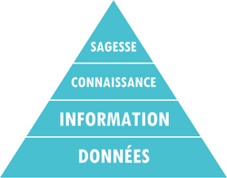
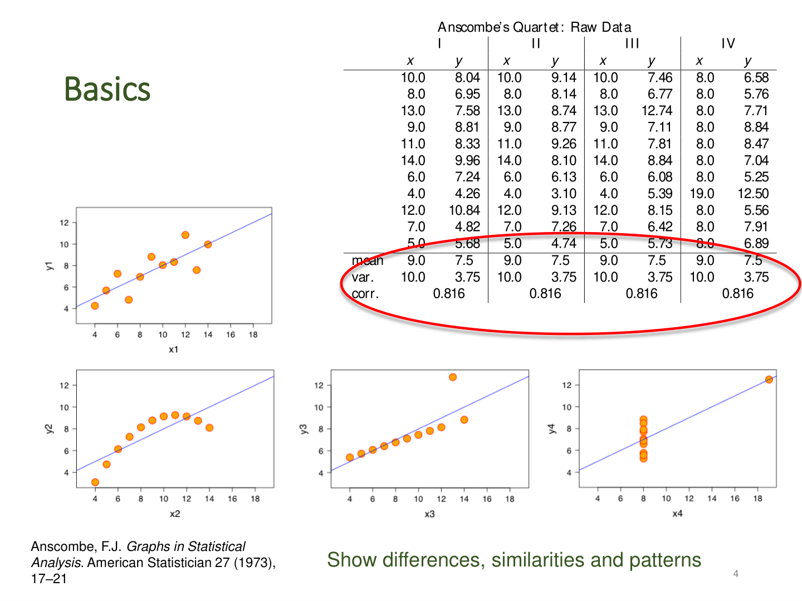
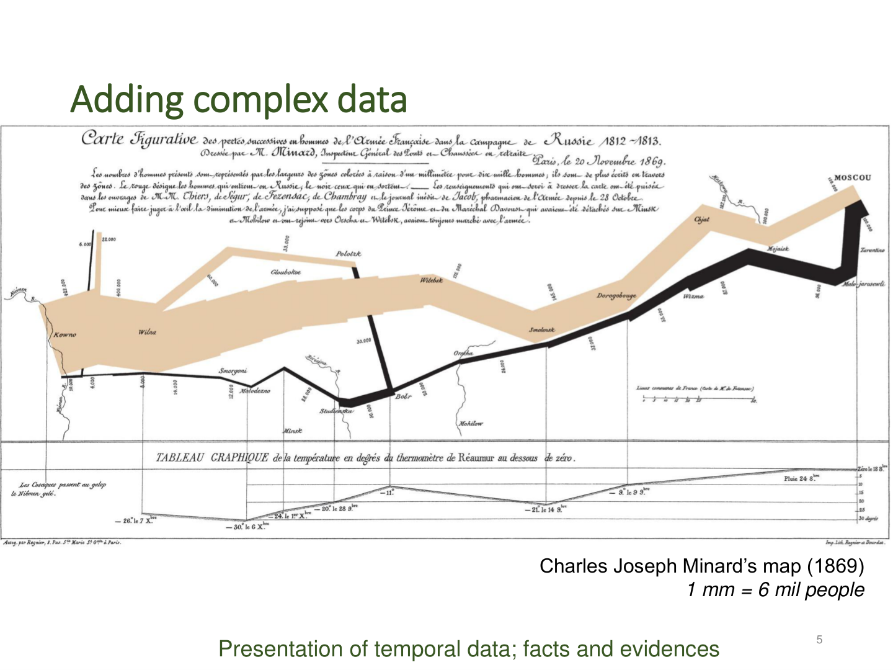
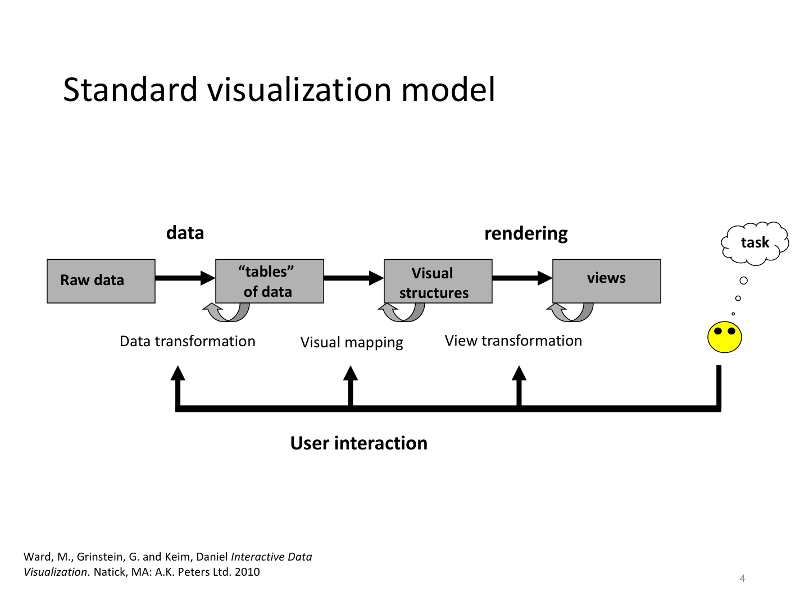
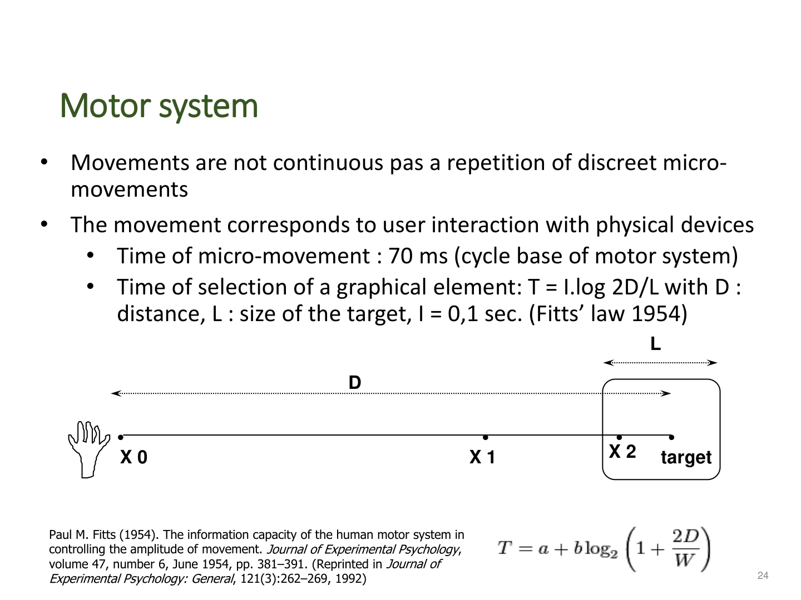
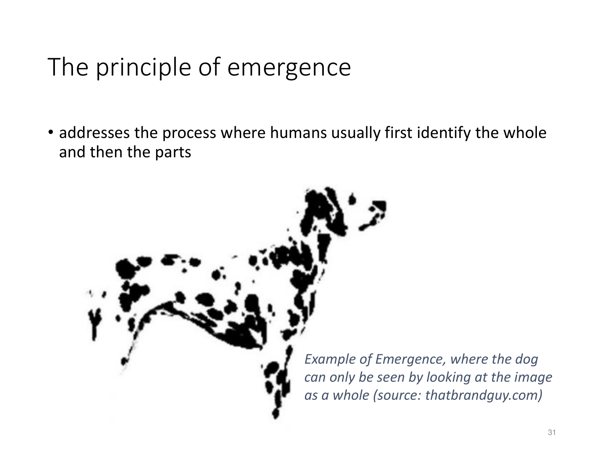
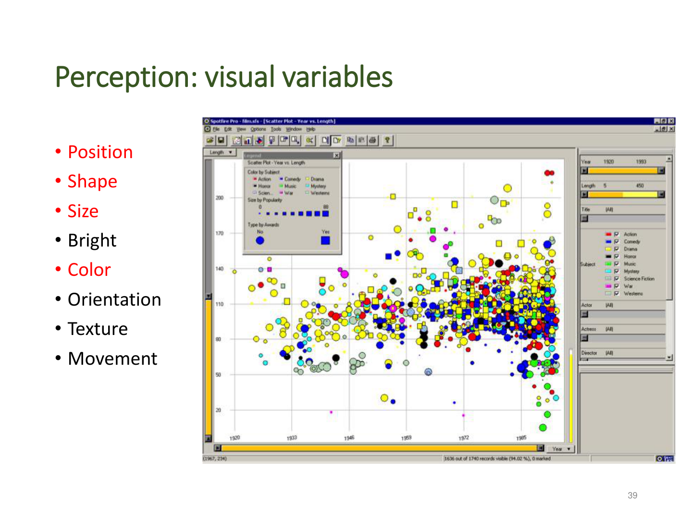
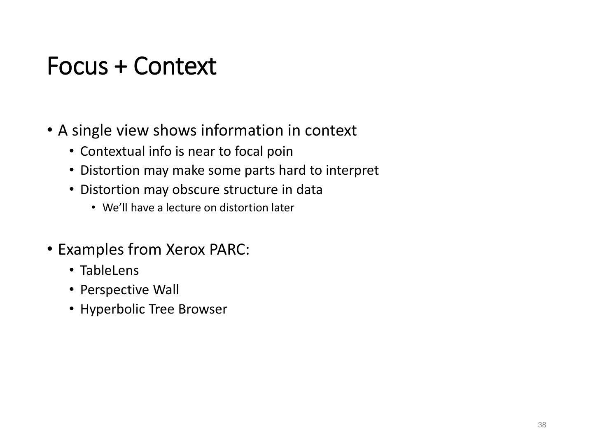
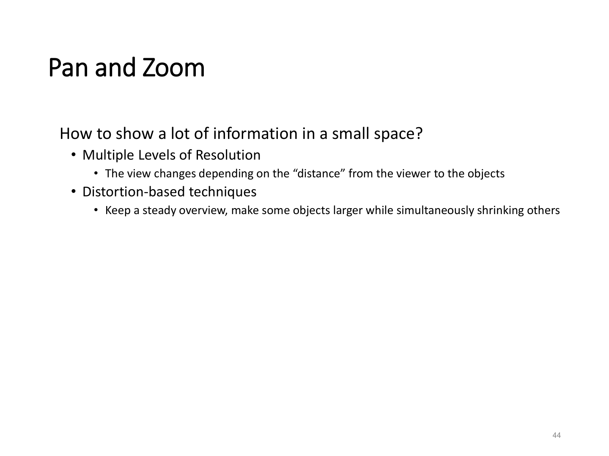

# Fiche de Revision - VISU cours 1 & 2

## Notions indispensables
| Theme                 | Notion cle                     | But                      |
| --------------------- | ------------------------------ | ------------------------ |
| Concept de base       | DIKW                           | Du data a la decision    |
| Ergonomie             | Loi de Fitts                   | Temps de mouvement       |
| Interaction           | Mantra de Shneiderman          | Explorer efficacement    |
| Perception            | Lois de Gestalt                | Lisibilite visuelle      |
| Design                | Variables visuelles            | Encoder les donnees      |
| Donnees               | Types 1D-Reseaux               | Adapter la visualisation |
| Taches                | Overview-Zoom-Filter-Details   | Structurer l'exploration |
| Modele analytique     | What-Why-How                   | Comprendre une infovis   |
| Techniques            | Overview+Detail, Focus+Context | Navigation efficace      |
| Performance           | 0.1 / 1 / 10 secondes          | Fluidite cognitive       |

## Fondamentaux : du data a l'insight
- **Hierarchie DIKW** : donnees (symboles bruts) -> information (mise en contexte) -> connaissance (application) -> sagesse (comprehension actionnable). Aide a cadrer la valeur de la visualisation.

- **"Graphics reveal data" (Tufte)** : visualiser rend visibles causalites, differences et anomalies (ex. John Snow, Anscombe).

- **Objectifs du cours** : comprendre les principes d'info-vis, manipuler pipeline + techniques, choisir les structures de donnees adaptees, developper des visualisations interactives fiables.
- **Risques** : axes tronques, donnees omises, confusions correlation/causalite -> toujours documenter sources et choix graphiques.

## Domaine et pipeline de visualisation
- **Definition** : communication d'information via representations graphiques (Ward, Ware, Telea).
- **Pipeline standard** : acquisition -> transformation des donnees -> mappage visuel -> rendu -> interactions / retours utilisateur.

- **Role de l'utilisateur** : interaction boucle perception-action (changement de scene, selection, navigation, reconfiguration, recodage visuel, filtrage, feedback, cout attentionnel).
- **Classification des jeux de donnees (Munzner)** :
  - Structures : tableaux, reseaux / arbres, champs (scalaires, vectoriels), items avec attributs, ensembles dynamiques.
  - Types : nominal, ordinal, quantitatif ; 1D, 2D, 3D, multi-dimensionnel, texte/hypertexte.
- **Taxonomie de Shneiderman** : types de donnees (1D, 2D cartes, 3D, multi-dim, temporelles, arbres, reseaux) <-> taches (overview, zoom, filter, details-on-demand, relate, history, extract).

## Perception & conception
- **Modele du processeur humain** : perception (sens), cognition (memoire de travail limitee, ~7+/-2 items, persistance visuelle 200 ms), moteur (micro-mouvements ~70 ms).
- **Loi de Fitts (1954)** : temps de selection `T = a + b * log2(D/W + 1)` (~ 0,1 s par micro-mouvement). Favoriser cibles larges/proches.

- **Preceptes de Stephen Few** : faire ressortir ce qui compte, s'appuyer sur patterns familiers, alleger la memoire de travail.
- **Lois de Gestalt** : emergence, reification, multi-stabilite, invariance + similarite, proximite, continuite, cloture, regions communes, points focaux, experiences passees.

- **Variables visuelles (Bertin)** : position, forme, taille, luminosite, couleur, orientation, texture, mouvement. Choisir selon nature des donnees (quantitative vs qualitative).

## Taches utilisateur & interaction
- **Mantra de Shneiderman** : overview -> zoom -> filter -> details-on-demand (avec relate, history, export pour completer).
- **Taches analytiques (Amar & Stasko)** : retrouver une valeur, filtrer, calculer, trouver limites / seuils, classifier, caracteriser distributions, detecter anomalies, regrouper, correler.
- **Bibliographie des taches** : Keller & Keller (identifier, localiser, distinguer...), Wehrend & Lewis, Springmeyer, Zhou & Feiner, Morse, Amar, Valiati.

- **Acceptable response times** : 0,1 s (animation fluide), 1 s (feedback systeme), 10 s (gestion cognitive). Viser latence < 1 s pour interactions frequentes.
- **Techniques d'interaction de base** : selection (clic, hover, lasso), navigation (zoom/pan), reorganisation (tri, layout), suppression/inclusion (filtres), changement de codage (switch chart/axes), feedback immediat.

## Modele analytique What-Why-How (Munzner, 2014)
- **What (donnees)** : type, structure, cardinalite, dynamique -> conditionne encodage.
- **Why (intentions)** :
  - Actions haut niveau : analyser (decouvrir vs presenter), apprecier, produire (annoter, enregistrer), deriver (calculs).
  - Mid/low-level : recherche selon connaissance du but (cible connue/inconnue), portee (un, quelques, tous elements).
- **How (encodages & interactions)** : combinaison de visual encodings (marks + channels) et techniques d'interaction (selection, navigation, filtrage, distorsion).
- **Targets** : elements vises (attribut, ensemble, reseau, temps, etc.) guident choix de vue et d'interaction.

## Strategies pour l'exploration de grands jeux de donnees
- **Scalabilite** : impossible de "tout montrer" -> arbitrer entre reduction, agregation, densification.
- **Reduction** :
  - Retrait (pruning) : moins d'items, attributs, plages de valeurs (scatterplots, requetes Spotfire). Attention perte d'information.
  - Groupement (clustering) : categories, regroupements spatiaux (TableLens), algos (k-means, hierarchiques), agregations statistiques (count, avg, min, max), abstractions semantiques (niveaux d'arbre).
  - Projection dimensionnelle : PCA, cartes de similarite pour nD -> 2D/3D.
- **Compression** : zoom geometrique vs zoom semantique (niveau de detail adapte a l'echelle).
- **Documents de reference** : SeeSoft (1 pixel/ligne), Parallel Coordinates (Inselberg), Spotfire (brushing & linking).

## Techniques de navigation et couplages de vues
- **Overview + Detail (O+D)** : vues separees, sans distorsion, ex. Gapminder, Treemaps (sequence temporelle), SeeSoft (espaces distincts).

- **Focus + Context (F+C)** : vue unique avec distorsion controlee pour conserver contexte (TableLens, Perspective Wall, Hyperbolic Tree). Attention lisibilite des zones compressees.

- **Brushing & Linking** : survol/selection synchronise plusieurs vues (Parallel Coordinates).
- **Zooming** :
  - Geometrique : zoom classique (Google Earth).
  - Intelligent : vitesse depend du geste (speed-dependent zoom).
  - Semantique : representation change selon niveau (Pad++, Piccolo, UI Gallery, vue restaurant selon prix).

- **Distorsion** : bifocal, perspective, bulle, fisheye, autres mappings non lineaires pour equilibrer contexte et focus.

## Bonnes pratiques & rappels projet
- Choisir visualisation en fonction du type de donnees (Munzner) et des taches utilisateur (Shneiderman).
- Garantir feedback rapide (< 1 s) et actions stables (undo/history).
- Documenter pipeline complet du dataset brut jusqu'aux variables visuelles, specifier utilisateurs cibles, taches et objectifs d'analyse.
- Prevoir au moins deux niveaux de visualisation (overview + details) et interactions essentielles (selection, filtres, navigation).
- S'appuyer sur references cles : Munzner (2014), Ware (2012), Murray (2013), Tufte (2001), Few (2009).

