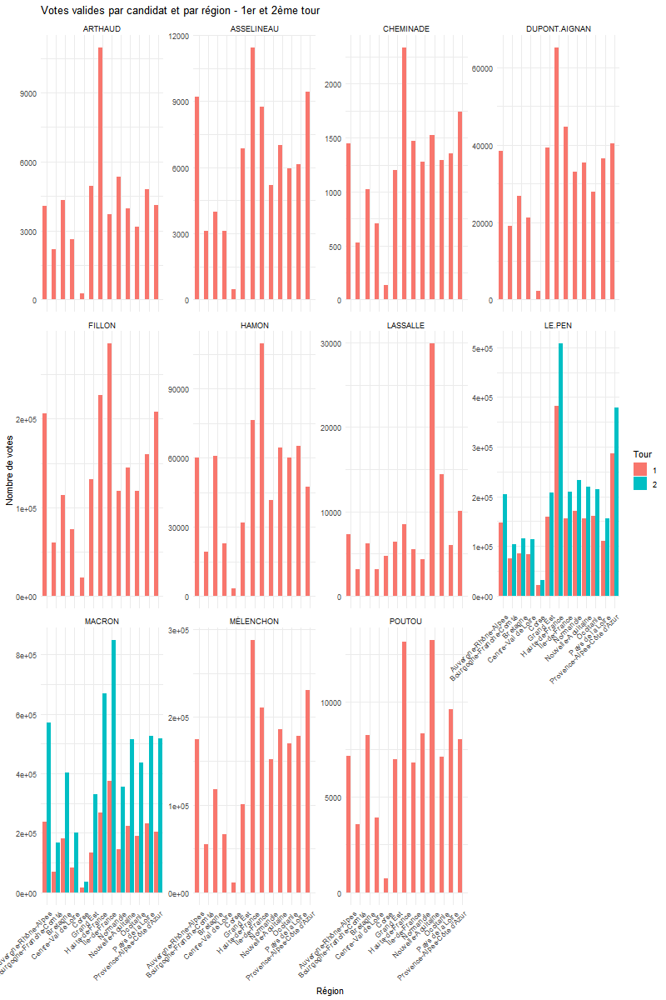
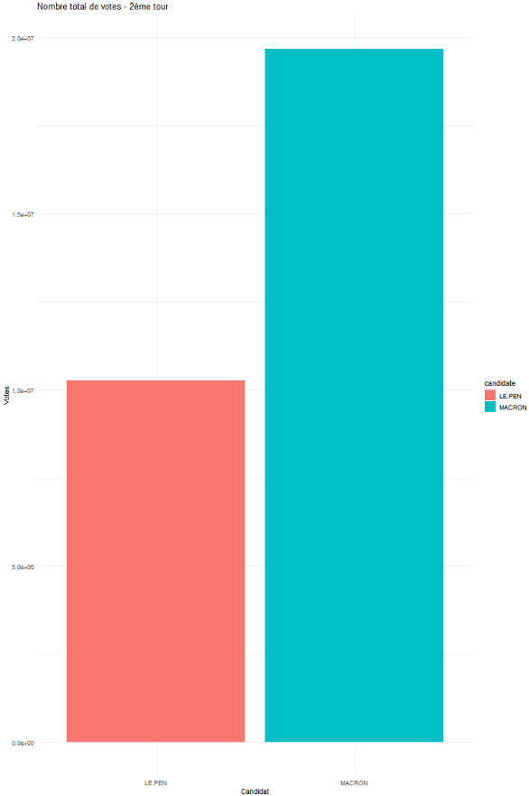
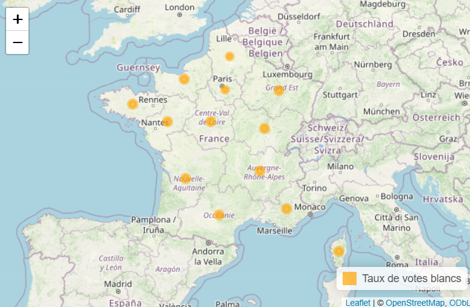

# TP1 : Visualisation des Résultats des Élections Présidentielles 2017

1. [Importation des données](#importation-des-données)
2. [Manipulation des données avec dplyr](#manipulation-des-données-avec-dplyr)
3. [Transformation des données avec tidyr](#transformation-des-données-avec-tidyr)
4. [Visualisation avec ggplot2](#visualisation-avec-ggplot2)
5. [Cartes statiques et interactives](#cartes-statiques-et-interactives)

---

## 1. Importation des données

```r
round1 <- read.csv("path_to_round1.csv")
round2 <- read.csv("path_to_round2.csv")
coords_region <- read.csv("path_to_coords_region.csv")
```

* `read.csv()` lit un fichier CSV et le transforme en data frame.
* On crée ici `round1`, `round2` et `coords_region`.

---

## 2. Manipulation des données avec dplyr

### a. Création de nouvelles colonnes

```r
round1 <- round1 %>%
  mutate(
    abstention_rate = absent_voters / registered_voters,
    voting_rate = present_voters / registered_voters,
    blank_rate = blank_ballot / votes_cast,
    null_rate = null_ballot / votes_cast,
    votes_cast_rate = votes_cast / present_voters,
    voter_rate = present_voters / registered_voters
  )
```

* `mutate()` ajoute des colonnes calculées à `round1`.
* Chaque colonne est basée sur des colonnes existantes.

### b. Agrégation de données

```r
sum_votes_round1 <- round1 %>%
  group_by(region_name) %>%
  summarise(sum_votes_cast = sum(votes_cast, na.rm = TRUE))
```

* `group_by()` regroupe les données par `region_name`.
* `summarise()` calcule la somme des votes par région.

### c. Fusion de tables

```r
round1 <- round1 %>% left_join(coords_region, by = c("region_code" = "insee_reg"))
```

* `left_join()` ajoute les coordonnées correspondant au `region_code`.
* Chaque ligne de `round1` garde ses données originales et récupère les informations correspondantes de `coords_region`.


### d. Transformation en format long

```r
results_tidy <- results %>% gather(key = "candidate", value = "votes", all_of(candidates))
```

* `gather()` transforme les colonnes candidats en deux colonnes `candidate` et `votes`.
* Cela permet d'avoir une ligne par candidat par région, ce qui facilite l'analyse et la visualisation.


---

## 3. Visualisation avec ggplot2

### a. Histogrammes par candidat

```r
p1 <- ggplot(round1_tidy, aes(x = region_name, y = votes, fill = candidate)) +
  geom_bar(stat = "identity", position = "dodge") +
  labs(title = "Nombre de votes valides par candidat et par région - 1er tour",
       x = "Région", y = "Nombre de votes", fill = "Candidat") +
  theme_minimal() +
  theme(axis.text.x = element_text(angle = 45, hjust = 1))
```

* `geom_bar(stat = "identity")` crée un histogramme où la hauteur de chaque barre correspond au nombre de votes pour un candidat.
* `position = "dodge"` place les barres des différents candidats côte à côte pour comparaison.
* Le graphique `p1` permet de visualiser la répartition des votes par candidat dans chaque région.
* `fill` dans `aes()` détermine la couleur des barres selon la variable choisie (ici le candidat). Cela permet de distinguer visuellement chaque candidat sur le graphique.


### b. Comparaison entre tours

```r
p2 <- ggplot(results_tidy, aes(x = region_name, y = votes, fill = factor(round))) +
  geom_bar(stat = "identity", position = "dodge") +
  facet_wrap(~candidate, scales = "free_y") +
  labs(title = "Votes valides par candidat et par région - 1er et 2ème tour",
       x = "Région", y = "Nombre de votes", fill = "Tour") +
  theme_minimal() +
  theme(axis.text.x = element_text(angle = 45, hjust = 1))
```

* Ici, on compare les votes entre le premier et le deuxième tour.
* `facet_wrap(~candidate)` crée un sous-graphique pour chaque candidat.
* Le graphique permet de visualiser comment les votes évoluent entre les tours pour chaque région et chaque candidat.
* `factor(round)` convertit la variable `round` en facteur, c'est-à-dire en variable catégorielle. Cela permet à ggplot de traiter chaque tour comme une catégorie distincte pour la couleur des barres.


<p align="center">
  
  <p align="center"><em>Figure 1 : Votes valides par candidat et par région pour les deux tours</em></p>
</p>

### c. Couleurs manuelles

```r
scale_fill_manual(values = c("MACRON" = "blue", "LE.PEN" = "red"))
```

* Définit des couleurs pour Macron et Le Pen.

---

## 4. Calculs de votes totaux par candidat

```r
votes_round2 <- round2_tidy %>%
  filter(candidate %in% c("MACRON", "LE.PEN")) %>%
  group_by(candidate) %>%
  summarise(total_votes = sum(votes, na.rm = TRUE))
```

* Calcule le total des votes du deuxième tour par candidat.

```r
p4 <- ggplot(votes_round2, aes(x = candidate, y = total_votes, fill = candidate)) +
  geom_bar(stat = "identity") +
  labs(title = "Nombre total de votes - 2ème tour", x = "Candidat", y = "Votes") +
  theme_minimal()
```

<p align="center">
  
  <p align="center"><em>Figure 2 : Total des votes du deuxième tour par candidat</em></p>
</p>

---

## 5. Cartes statiques et interactives

### a. Conversion en objet spatial

```r
coords_region_sf <- coords_region %>% st_as_sf(coords = c("longitude", "latitude"), crs = 4326)
```

- ``st_as_sf()`` transforme un data frame avec colonnes de coordonnées en objet spatial ``sf``.

- ``coords`` indique quelles colonnes représentent longitude et latitude.

- ``crs`` définit le système de projection (ici WGS84).

- Ceci est nécessaire pour pouvoir utiliser les fonctions de cartographie de ``sf`` ou ``leaflet``.

### b. Carte interactive des votes blancs

```r
# Calculer le taux de votes blancs par région
blank_rate_region <- round2 %>%
  group_by(region_code, region_name) %>%
  summarise(blank_rate = sum(blank_ballot, na.rm = TRUE) / sum(votes_cast, na.rm = TRUE),
            .groups = "drop")

# Joindre les coordonnées spatiales et extraire longitude et latitude
map_data <- blank_rate_region %>%
  left_join(coords_region_sf, by = c("region_code" = "insee_reg")) %>%
  mutate(longitude = st_coordinates(geometry)[,1],
         latitude  = st_coordinates(geometry)[,2])

# Créer la carte interactive
library(leaflet)
leaflet(map_data) %>%
  addTiles() %>%
  addCircleMarkers(
    ~longitude, ~latitude,
    radius = ~blank_rate * 50,           # Taille du cercle proportionnelle au taux de votes blancs
    color = "orange",                   # Couleur du contour du cercle
    fillOpacity = 0.6,                   # Opacité de remplissage du cercle
    label = ~paste(region_name, ": ", round(blank_rate*100, 2), "% votes blancs")  # Label au survol
  ) %>%
  addLegend(
    "bottomright",
    colors = "orange",
    labels = "Taux de votes blancs",
    opacity = 0.7
```


**Explications** :
 - ``group_by()`` : regroupe les données par région pour calculer le taux de votes blancs.
 - ``summarise()`` : calcule la proportion de votes blancs sur le total des votes.
 - ``left_join()`` : associe les coordonnées spatiales pour chaque région.
 - ``mutate()`` avec ``st_coordinates()`` : extrait longitude et latitude depuis l'objet sf.
 - ``addCircleMarkers()`` : crée un cercle sur la carte pour chaque région, avec taille et label.
 - ``color`` et ``fillOpacity`` : définissent l'apparence visuelle des cercles.
 - ``addLegend()`` : ajoute une légende pour expliquer la signification des couleurs et tailles des cercles.

<p align="center">
  
  <p align="center"><em>Figure 3 : Carte interactive des votes blancs par région</em></p>
</p>
