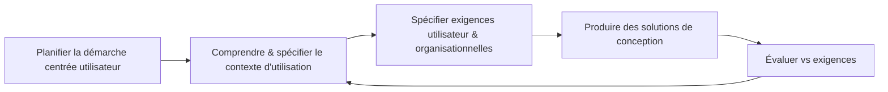

# Fiche de révision – Conception de Systèmes Interactifs (SI5)

## Vue d'ensemble rapide

> **Objectif.** Maîtriser la conception, le prototypage et l’évaluation d’IHM utilisables.
>
> **Évaluation.** Examen individuel + projet en groupe (un livrable par séance, rapport final).
>
> **Références.** Nielsen (Usability Engineering), Mayhew (Usability Engineering Lifecycle), Lazar et al. (Research Methods in HCI), Nogier/Bouillot/Leclerc (Ergonomie des interfaces).

## Lexique essentiel
| Concept | À retenir |
| --- | --- |
| **Utilisabilité (ISO 9241)** | Efficacité, efficience, satisfaction dans un contexte d’usage donné. |
| **User Experience (UX)** | Perceptions et émotions avant/pendant/après usage ; dimensions : esthétique, émotion, stimulation, identification, sens/valeur, social. |
| **Accessibilité** | Conception inclusive pour capacités variées (penser aux évolutions liées à l’âge). |
| **Qualités d’une IHM** | Learnability (prévisibilité, synthèse, familiarité), Flexibility (initiative de dialogue, multitâche, migration), Robustness (observabilité, récupérabilité, réactivité, conformité tâche). |

> 💡 **Astuce mesure.** Combiner performances (succès, temps, erreurs), ressenti (satisfaction, stress) et conformité aux standards ergonomiques.

## Séance 1 – Concepts de base & Design centré utilisateur
### Pourquoi l’utilisabilité compte

- Mauvaises interfaces ≠ contournements et erreurs (ex. machine à café, robinets).
- Indices : tâches impossibles, durées élevées, erreurs fréquentes, faible satisfaction, non-respect de règles ergonomiques.

### Processus UCD (ISO 9241-210)


- **Planifier** : expliciter bénéfices ROI, rassembler équipe multidisciplinaire, préparer chartes/process.
- **Comprendre le contexte** : profils utilisateurs, tâches, environnements (technique, physique, social, légal).
- **Spécifier** : objectifs d’utilisabilité (succès, erreurs, temps, satisfaction…), contraintes organisationnelles.
- **Concevoir** : prototyper, documenter options/choix.
- **Évaluer** : tests utilisateurs, inspections, priorisation des défauts.

> ✨ **À retenir.** L’UCD est une spirale ; garder les traces des décisions pour alimenter la rationale (séance 5).

## Séance 2 – Comprendre et décrire ses utilisateurs
### Identifier les groupes cibles

- Définir population → échantillon représentatif → documenter démographie, attitudes, fréquence d’usage, expertise, langage.
- Distinguer utilisateurs primaires, secondaires, décideurs, représentants.

### Classer compétences & usage

- Modèle Dreyfus : novice → débutant avancé → compétent → performant → expert.
- Fréquence : constante, régulière, occasionnelle ; croiser avec familiarité technologique.
- Matrice utilisateur/tâche = qui fait quoi et à quelle fréquence.

### Outils de profilage

- Questionnaires de profil : données structurées.
- User roles : regrouper responsabilités, objectifs, conflits potentiels.
- Personas : archetypes basés sur données (motivations, irritants, activités clés) → nourrissent scénarios.
- User stories : « En tant que <rôle> je veux <action> afin de <bénéfice> » + critères d’acceptation.

> 💡 **Réflexe terrain.** Valider ses hypothèses auprès des équipes terrain (support, hotline) et éviter les stéréotypes figés.

## Séance 2 bis – Questionnaires & entretiens
### Quand recourir aux enquêtes

- Avantages : large panel, coût faible, administration simple, vue d’ensemble rapide.
- Limites : profondeur limitée, pas de relance, biais de rappel, dépend de la qualité de la formulation.

### Concevoir les questions

- Choisir forme : ouvertes (exploration), fermées (comparaisons), semi-fermées.
- Échelles : Likert, fréquence, intensité émotionnelle (SAM) ; préciser libellés.
- Structurer l’instrument (ordre logique, regroupements thématiques).
- Pré-test indispensable pour détecter ambiguïtés (échantillon restreint représentatif).

### Biais fréquents

- Primacy / Recency : premières options choisies à l’écrit, dernières à l’oral.
- Effet de catégorie : intervalles asymétriques ou bornes floues → distorsion.
- Direction de comparaison : formulation influence jugement.
- Surcharge : trop d’options = réponses superficielles ; laisser temps aux répondants.

### Règles d’interview

- Types : structuré (ordre fixe), semi-structuré, non-directif.
- Préparer guide + questions neutres ; relancer sans suggérer.
- Logistique : consentement, enregistrement, prise de notes.
- Analyse : transcription et codage (≈10 h d’analyse pour 1 h d’audio).

## Séance 3 – Prototypage
### Rôle du prototypage

- Explorer l’espace de design, détecter tôt problèmes d’utilisabilité, favoriser communication pluridisciplinaire, justifier choix (go/no-go).

### Typologies utiles

- **Fidélité (McCurdy)** : raffinement visuel, largeur/profondeur fonctionnelle, richesse d’interaction, richesse du modèle de données.
- **B.-Lafon & Mackay** : représentation (papier/logiciel), précision (informelle → polie), interactivité (passive → interactive), évolution (jetable, itératif, incrémental).
- **Rôle dans le processus** : expansion (générer options) vs contraction (sélectionner/affiner).
- **Durée de vie** : rapide (papier, vidéo, Wizard of Oz), itératif, évolutif.

- Low-fi : coût faible, co-conception, spécifications souples ; limites sur vérification d’erreurs.
- High-fi : tests réalistes, support marketing ; coûteux, maintenance lourde.

### Gestion des itérations

```mermaid
graph TD
    A[Élaboration\n(diversifier les solutions)] --> B[Réduction\n(sélectionner & raffiner)]
    B --> A
```
- Distinguer choix d’options vs évolution d’une même option.

### Annotations

- Fonctions : clarifier, demander, commenter, vérifier, faire valider, proposer, planifier.
- Types : texte, symboles, dessins, enregistrements, modifications.
- Outils : Balsamiq, Uxpin, Figma (intégrés) ; WebNotes… (externes).

## Séance 4 – Modèles de tâches
### Pourquoi modéliser

- Mettre en avant informations critiques, maîtriser complexité, documenter, préparer conception coopérative, soutenir évaluation (comparaison tâches ↔ UI).

### Concepts clés

- Tâche : activité orientée but ; se décompose en tâches de base.
- Tâche vs activité : on décrit ce que fait l’utilisateur, pas les opérations système.
- Attention au niveau d’abstraction (du geste clavier au but métier).

### Construire un modèle
1. Lister tâches.
2. Regrouper en tâches de haut niveau.
3. Raffiner jusqu’au niveau pertinent (éviter micro-gestes inutiles).
4. Vérifier cohérence (actions couplées, équilibre, généralisation).
5. Valider auprès des utilisateurs/expert métier.

### Notations & outils

- ConcurTaskTrees : opérateurs temporels, tâches parallèles/séquentielles.
- HAMSTERS : édition, simulation, analyse performance, migration de tâches.
- Modèles pour systèmes existants vs envisagés → penser co-évolution task/artifact.

## Séance 5 – Design Rationale
### Intérêt

- Rendre explicites discussions, compromis, justifications ; facilite communication, capitalisation et négociation.

### Démarche
1. Scénarios (goals, opportunisme, how-to, sense-making).
2. Claims (énoncés) avec bénéfices/risques documentés.
3. Analyse (théories HCI, retours, tests).
4. Décisions : sélectionner option + critères.

### Notations

- gIBIS : Questions / Ideas / Arguments.
- QOC : Questions – Options – Criteria (grille des alternatives).
- TEAM / DREAM : enrichit QOC (facteurs, traçabilité, artefacts liés, scénarios). Outil DREAMER pour éditer/argumenter.

> 💡 **Traçabilité.** Relier options, exigences, modèles de tâches et prototypes pour préserver la trace des choix.

## Séance 6 – Méthodes d’inspection & analyses analytiques
### Panorama des méthodes d’évaluation

```mermaid
graph LR
    A[Usability Evaluation Methods] --> B[Inspection]
    A --> C[Tests utilisateurs]
    A --> D[Enquêtes]
    A --> E[Modélisation analytique]
    B --> B1[Heuristic Evaluation]
    B --> B2[Cognitive/Pluralistic Walkthrough]
    B --> B3[Guidelines & Normes]
    C --> C1[Think-aloud]
    C --> C2[Wizard of Oz]
    D --> D1[Questionnaires satisfaction]
    D --> D2[Charge mentale (NASA-TLX)]
    E --> E1[GOMS/KLM]
    E --> E2[Analyse par modèles de tâches]
```

### Heuristic Evaluation (Nielsen & Molich)

| # | Heuristique |
| --- | --- |
| 1 | Dialogues simples et naturels. |
| 2 | Langage utilisateur. |
| 3 | Minimiser la charge cognitive (reconnaissance > rappel). |
| 4 | Cohérence. |
| 5 | Feedback informatif. |
| 6 | Visibilité de l’état du système. |
| 7 | Raccourcis pour experts. |
| 8 | Messages d’erreur clairs. |
| 9 | Prévention/gestion des erreurs. |
| 10 | Aide et documentation. |

- **Procédure** : évaluateurs indépendants → consolidation → priorisation.

### Cognitive Walkthrough

- Vérifie qu’un nouvel utilisateur peut réaliser un scénario.
- Préparation : profils/personas, tâches clés, maquettes ou captures.
- Questions par action : intention ? action visible ? correspondance action-effet ? feedback compréhensible ?
- Équipe : facilitateur (rythme), scribe (problèmes + suggestions), évaluateurs.

### GOMS & KLM

- Composants : Goals, Operators (K, P, H, M, D, R), Methods, Selection rules.
- KLM : séquence opérateurs → règles de Raskin → temps total prédictif.
- Usage : comparer designs, profiler temps expert, alimenter aides contextuelles.
- Limites : tâches routinières seulement, utilisateurs experts, aspects perceptifs non couverts.

### Reporter & prioriser

- Sévérité = Impact (critique/important/mineur) × Fréquence (forte/moyenne/faible).
- Common Industry Format (CIF) = format de rapport standardisé.
- Tests formatifs (pendant conception) vs sommatifs (bilan, comparaison marché).
- Documenter : description, contexte, heuristique violée, recommandation.

## Réflexes généraux

- Relier systématiquement constats utilisateurs ↔ décisions de conception (boucle UCD).
- Versionner prototypes + feedbacks (traçabilité pour design rationale).
- Préparer plan de test, feuilles de séance, rapport de synthèse.
- Capitaliser sur la bibliographie du cours (Nielsen, Mayhew, Rubin, Lazar, Carroll & Rosson, Palanque et al.).
